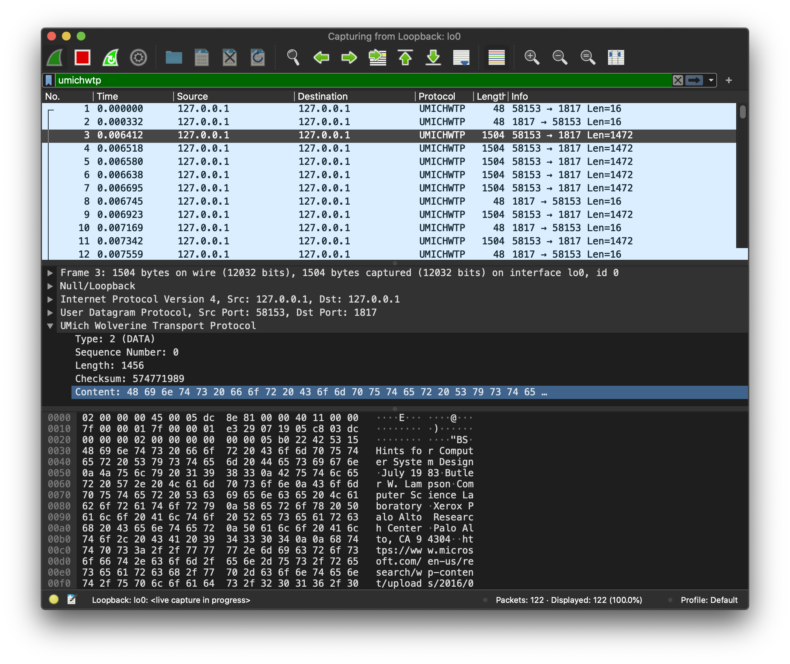

# UMich Wolverine Transport Protocol (WTP) Wireshark Dissector

A simple Lua script for Wireshark to dissect WTP packets in 
UDP datagrams.

WTP is [defined in an assignment](https://github.com/mosharaf/eecs489/tree/f21/Assignments/Assignment-3)
for the course [EECS 489: Computer Networks](https://github.com/mosharaf/eecs489) 
at the University of Michigan, Ann Arbor.

The script assumes UDP port 1817 (UMich's founding year) is being 
used for communication with the receiver. I used this after 
looking  around port registries and not finding anything of value
using this port, but it can be changed in the last line of the 
script.

## Wireshark Usage Example

Add this script to Wireshark's "Personal Lua Plugins" directory
(can be found under _About > Folders_)

Set the display filter to `umichwtp` and start capturing packets
on the appropriate interface.

